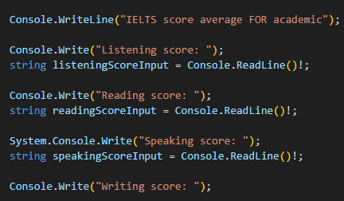
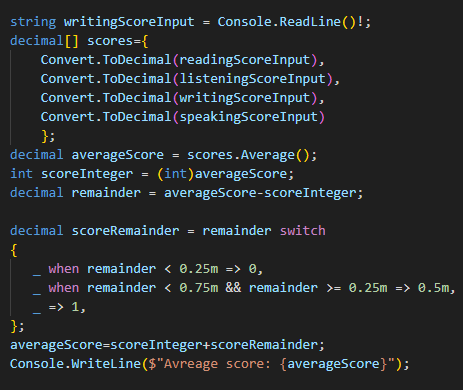

 

# **IELTS** baxolash tizimi quyidagicha ishlaydi: 

----

  > Barcha **IELTS** ballari 0 dan 9 gacha bolgan sistemada xisoblanadi. Imtixon topshiruvchi 5 ball xam, 9 ball xam olishi mumkin. Bu sistema to`rt yonalish boyicha (Listening, Reading, Writing, Speaking) olingan umumiy ballarni xisoblaydi. Imtixon topshiruvchining xar bir yonalishdan olgan ballari qoshilib umumiy **IELTS** natijasi chiqariladi. Misol tariqasida quyidagi jadvalni korishingiz mumkin.

| Listening | Reading | Writing | Speaking | Oveall |
|:-:|:-:|:-:|:-:|-:| 
| 9  |  8  |  8  |  8  | 8.5  |
| | | | | 
> **IELTS** imtixon natijalari eng yaqin 0.5 ballga xisoblanadi. Bu shuni anglatadiki, agar yakuniy ball aniq 7.5 bolmasa eng yaqin bolgan past yoki eng yaqin bolgan yuqori ballga qoyiladi.

 `Masalan:`
 -  Agar sizning umumiy ballingiz 6.1 bolsa sizning ballingiz 6 ga tushadi.
 - Agar sizning umumiy ballingiz 6.25 bolsa sizning ballingiz 6.5 ga kotariladi.
 - Agar sizning umumiy ballingiz 6.65 bolsa sizning 
 ballingiz 6 ga tushadi.
 - Agar sizning umumiy ballingiz 6.75 bolsa sizning ballingiz 7 ga kotarildi.
 - Korib turganingizdek sizning ballingiz yuqorida korsatilganidek eng yaqin 0.5 ga yoki butun ballga yaxlilanadi. Siz bu xaqda toliq malumot olish uchun [bu yerga bosing](https://www.britishcouncil.org.tr/en/exam/ielts/calculator)

 **IELTS** imtixoniga qoyiladiga ballar tasniflari
 
 ```
 Quyidagi jadvalda 5 dan 9 gacha bolgan ballar uchun talab qilinadigan igliz tili darajasi uchun malumotlar berilgan
 ```
| Score | English level | Description                | Key Roints 
:-:|:-:|:-:|:-:|                                      
9  |     Expert user    | Imtixon topshiruvchi tilni to'liq ishlatish qobiliyatiga ega. Uning ingliz tilidan foydalanishlari to'g'ri va ravon bo'lib, Ingliz tilini to'liq tushunishni ko'rsatadi.|  1. Aniq tushinadi  2. Toliq tushinadi
8  |     Very good      | Imtixon topshiruvchi tilni to'liq bila oladi, faqat vaqti-vaqti bilan tizimsiz noaniqliklar va xatolarga yol qoyadi. Ular notanish vaziyatlarda ba'zi narsalarni noto'g'ri tushunishlari mumkin. Ular murakkab va batafsil argumentlarni yaxshi hal qilishadi.                  | 1. Kam xato 2. Ingliz tilidan yaxshi foydalanish
7  |     Good user      | Imtixon topshiruvchida ba'zi holatlarda noto'g'ri foydalanish va tushunmovchiliklar bo'lsa-da, tilni tezkor bilishga qobilyatiga ega. Ular odatda murakkab tilni yaxshi tushunadilar va batafsil mulohazalarni tushunadilar.  | 1. Kamdan kam xato qiladi 2. Ingliz tilidan yaxshi foydalanadi
6  |     Competent user | Imtixon topshiruvchi ba'zi noaniqliklar, noto'g'ri foydalanish va tushunmovchiliklarga qaramay, tilni samarali biladi.Ular qiyin vaziyatlarda juda murakkab tildan foydalanishi va tushunishi mumkin.      | 1. Bazan xato qiladi 2. Kopxollarda Ingliz tilidan yaxshi foydalanadi
5  |     Modest user    | Imtixon topshiruvchi tilni qisman biladi va ko'p hollarda xatoga yo'l qo'yishi mumkin bo'lsa-da, umumiy ma'noni engadi. Ular o'z sohalarida asosiy muloqotni boshqara olishlari kerak.                        | 1. Kop xato qiladi 2. Ingliz tilida qiyinchilikka duch kekadi


# IELTS ballarini xisoblab beruvchi dastur
  *ushbu dastur yordamida IELTS dan olgan ballaringizni xisoblab olishingiz mumkin* 

  # Birinchi qism

  

  # Ikkinchi qism

  


  